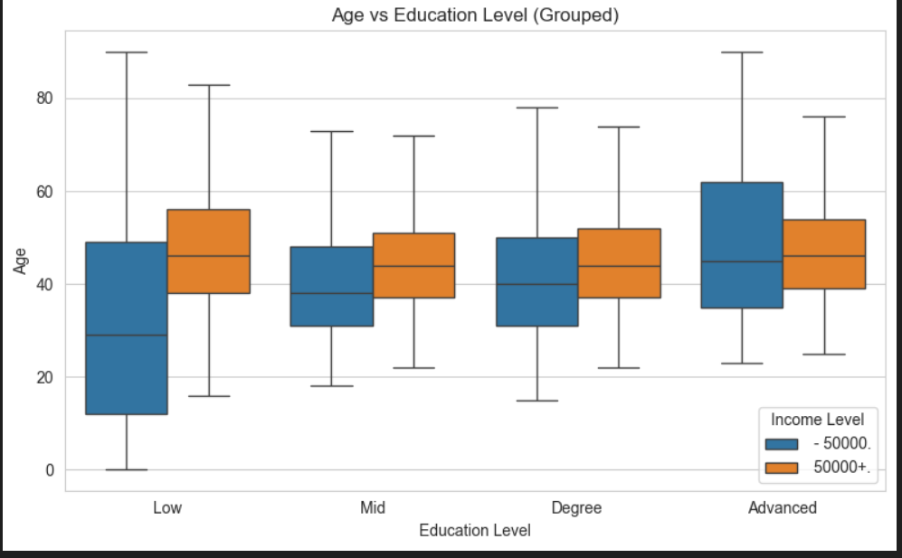
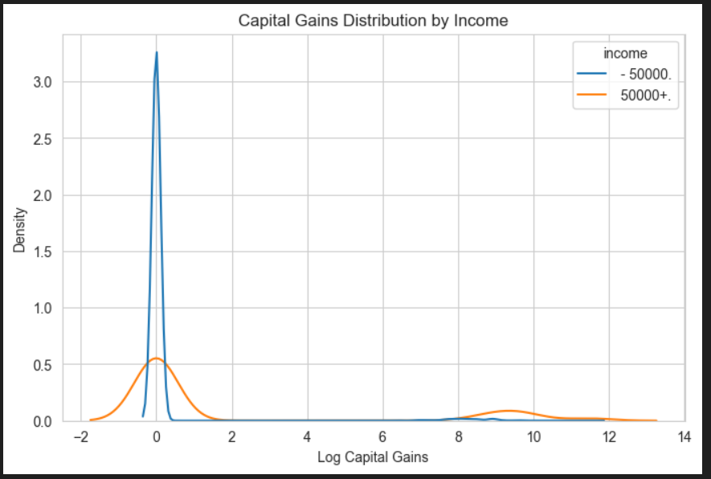

# Dataiku-income-prediction-assessment
The following is my technical assessment submission repo for Dataiku March 2026 - Snr Data Scientist Position.  

# Objective
Predict whether an individual earns more than USD 50k using captured metrics from the census conducted

# Approach

1.Exploratory Data Analysis in the main data analysis notebook 

2.Preprocessing was handled in preprocessing.py

3.feature engineering implemented in feature_engineering.py

4.The final train.py file generates a complete report on the testing and findings. I explored using linear regression and random forest. These were both run against a baseline where no feature engineering was done to evaluate the improvement and effectiveness of my feature engineering. 

# Project Structure
Main files can be found in src folder, while the eda is the notebooks folder. To ensure a timely submission I did not store any trained models or pre processed data. 

# How to Run

Simply in terminal run "python  src/train.py"

The same can be done for the other 2 files as src/preprocessing.py and src/feature_engineering.py to see their outputs, but not required for code execution"

## Results

Initial Data Analysis showed as a solid baseline in being able to identify which attributes would prove the most important in being able to identify key drivers for the models. 

Below is an output of comparing  education, age and income:

During the analysis I also noted a heavy skewness in the amount of individuals who have no capital gains. I decided to apply log a log transformation to this attribute to further investigate:

The follwoing shows the model performance. I compared a baseline logistic regression model with no feature engineering, an engineered logistic regression and lastly a random forest model.

### Model Performance

| Model | Accuracy | Precision | Recall | F1 Score | ROC-AUC |
|------|---------|----------|--------|----------|--------|
| Logistic Regression (baseline) | 0.856 | 0.289 | 0.891 | 0.436 | 0.946 |
| Logistic Regression (engineered) | 0.861 | 0.296 | 0.892 | 0.445 | 0.948 |
| Random Forest (engineered) | 0.931 | 0.468 | 0.744 | 0.575 | 0.950 |

### Key Findings

- Feature engineering improved Logistic Regression performance:
  - **F1 Score: +0.009**
  - **Precision: +0.007**
  - **ROC-AUC: +0.002**
  - Feature space increased from **36 → 43 features**

- Logistic Regression:
  - High recall (~0.89)
  - Low precision (~0.29)  
  → Many false positives

- Random Forest:
  - **F1 Score: +0.130 vs Logistic Regression**
  - **Accuracy: +7.0%**
  - **Precision: +0.172**
  - Slight recall drop (-0.148), but overall much better balance

### Key Drivers of High Income (Random Forest)

1. occupation code  
2. weeks worked in year  
3. age  
4. number of persons worked for employer  
5. industry code  
6. worked_last_year  
7. sex  
8. dividends from stocks  
9. education  
10. dividends (log-transformed)  

### Summary

- Feature engineering provided modest improvements for linear models  
- Random Forest captured non-linear relationships more effectively  
- Key drivers: occupation, volume of work done, education levels and financial indicators

# Potential improvements:

- Perform hyperparameter tuning (GridSearch / RandomSearch)
- Explore more advanced models such as Gradient Boosting

Introduce ML Ops considerations:

- Model versioning can be introduced to maintain a training history, including model parameters, feature sets, and performance metrics
- Monitoring for data drift and include tracking feature distributions against baselines
- Monitor key metrics like F1, precision and recall over time to alert when a retraining or intervention my be required

